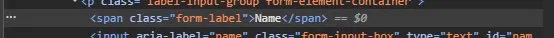

## Code Review Exercise

### Issue #1: HTML Semantics

The "More Info" buttons are `<a>` tags instead of `<button>` tags. The `<a>` tag is meant for links that navigate to another page, but these don't go anywhere. Since they are meant to be clicked like buttons, they should use the `<button>` tag instead.


Initial code:

```html
<a class="more-info-button">More Info</a>
```

Updated code:

```html
<button class="more-info-button">More Info</button>
```

---

### Issue #2: Accessibility

The form uses `<span>` elements instead of `<label>` elements for the input labels. Labels should use the `<label>` tag with a `for` attribute that matches the input's `id`. Without this, clicking the label text won't focus the input, and screen readers won't know what the input is for.



Initial code:

```html
<p class="label-input-group form-element-container">
  <span class="form-label">Name</span>
  <input
    aria-label="name"
    class="form-input-box"
    type="text"
    id="name"
    name="name"
  />
</p>
```

Updated code:

```html
<p class="label-input-group form-element-container">
  <label class="form-label" for="name">Name</label>
  <input class="form-input-box" type="text" id="name" name="name" />
</p>
```
